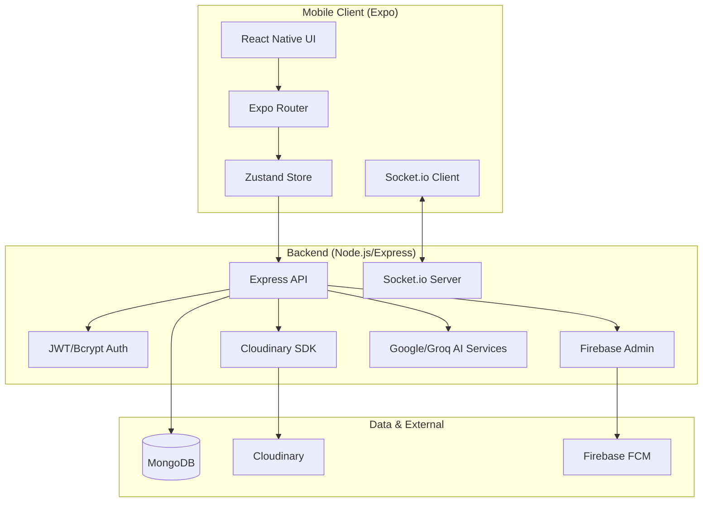

# Architecture

> Auto-generated by Antigravity on 2026-05-16

## Overview

**StudentSociety** is a full-stack social platform designed for students and college communities. It features a mobile-first experience built with React Native and a robust Node.js/Express backend.

### System Diagram

## Components

### Mobile (Client)
- **Purpose:** Primary user interface for students.
- **Location:** `mobile/`
- **Architecture:** Expo Router (File-based routing), NativeWind (Styling), Zustand (State).
- **Key Screens:** Feed, Study Hub, Teams, Chat, Profile, Settings.

### Backend (Server)
- **Purpose:** Core business logic, data persistence, and real-time services.
- **Location:** `backend/`
- **Architecture:** MVC-ish pattern with Controllers, Models, Routes, and Services.
- **Key Services:** Authentication, Post Management, Real-time Chat, Team Management, AI features, Notifications.

## Data Flow
1. **User Interaction:** User performs an action on the mobile app.
2. **API Request:** App sends an authenticated (JWT) request to the Express backend.
3. **Logic Execution:** Backend validates input (Joi), processes logic (Services), and interacts with MongoDB (Mongoose).
4. **Real-time Updates:** Changes are broadcasted via Socket.io for immediate UI updates (e.g., chat messages).
5. **Media:** Images are uploaded through Multer/Cloudinary.

## Conventions
- **Naming:** CamelCase for files and components in mobile; camelCase for backend files and variables.
- **Structure:** Feature-based routing in backend; file-based routing in mobile (`app/` directory).
- **Styling:** Utility-first with Tailwind/NativeWind.
