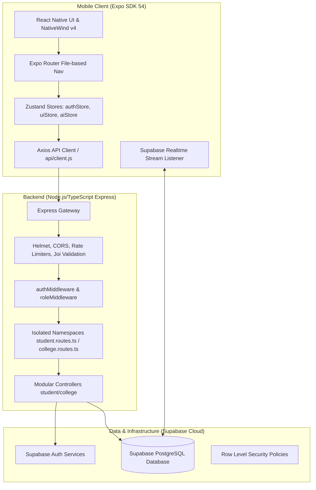
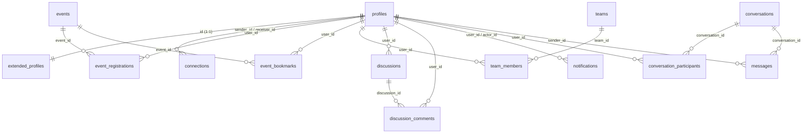

# 🛡️ StudentSociety: Premium System Overview & Feature Update Playbook

Welcome to the ultimate system overview of **StudentSociety** (v2.0)! This comprehensive guide outlines the entire stack, detailing how the **React Native Expo Client**, **TypeScript Express Backend**, and **Supabase Database** collaborate. It also provides a robust **"Zero-Issue" Feature Update Playbook** to ensure you can seamlessly scale and add new features without breaking existing flows.

---

## 🏗️ 1. High-Level System Architecture

StudentSociety is a state-of-the-art full-stack platform built on three modern, decoupled layers:



---

## 💾 2. Supabase Postgres Database Schema

The database consists of **12 main relational tables** secured by **Row Level Security (RLS) policies**. 

### Table Relationships & Structure



### Table Reference Guide

| Table Name | Primary Key | Key Columns / Data Types | Purpose / Context |
| :--- | :--- | :--- | :--- |
| **`profiles`** | `id` (UUID) | `email` (TEXT), `role` ('student', 'college') | Extends Supabase Auth users to map system-wide roles. |
| **`extended_profiles`** | `id` (UUID) | `full_name`, `avatar_url`, `role_title`, `university`, `location`, `bio` (TEXT), `skills` (TEXT[]), `interests` (TEXT[]), `goal` (TEXT), `settings_push` (BOOL), `settings_email` (BOOL), `settings_visibility` (TEXT) | Profile data for students, including privacy options. |
| **`events`** | `id` (UUID) | `title`, `description` (TEXT), `event_type` ('Hackathon','Workshop','Competition'), `organizer`, `location`, `banner_url` (TEXT), `reg_deadline` (TIMESTAMPTZ), `is_online` (BOOL), `min_team`, `max_team` (INT), `prize_pool` (TEXT), `registration_type` ('internal', 'external'), `external_link` (TEXT) | Events posted by colleges, allowing student registrations. |
| **`event_bookmarks`** | `(user_id, event_id)` | — | Track which events a student bookmarks. |
| **`event_registrations`** | `id` (UUID) | `event_id` (UUID), `user_id` (UUID) | Relational join table tracking student registrations. |
| **`connections`** | `id` (UUID) | `sender_id`, `receiver_id` (UUID), `status` ('pending', 'accepted', 'declined') | Handles connections/invitations between student peers. |
| **`activities`** | `id` (UUID) | `user_id` (UUID), `action_type`, `description` (TEXT) | Activity logs for student dashboard updates. |
| **`teams`** | `id` (UUID) | `name`, `event_name` (TEXT), `created_by` (UUID), `max_members` (INT) | Team workspace profiles formed by students for events. |
| **`team_members`** | `(team_id, user_id)` | `role` ('Leader', 'Member'), `skill_tag` (TEXT) | Member mappings within team workspaces. |
| **`conversations`** | `id` (UUID) | — | Instantiates chat conversations between users. |
| **`conversation_participants`** | `(conversation_id, user_id)`| — | Join table mapping participants to conversations. |
| **`messages`** | `id` (UUID) | `conversation_id`, `sender_id` (UUID), `content` (TEXT) | Chat logs for 1-on-1 private messaging. |
| **`notifications`** | `id` (UUID) | `user_id`, `actor_id` (UUID), `type` ('connection_accepted', 'team_invite', 'event_post', 'connection_request'), `content` (TEXT), `is_read` (BOOL) | Triggers and routes workspace push/email preferences. |
| **`discussions`** | `id` (UUID) | `user_id` (UUID), `title`, `content` (TEXT), `type` ('question', 'team_search') | Forum discussions where student ask questions/find members. |
| **`discussion_comments`** | `id` (UUID) | `discussion_id` (UUID), `user_id` (UUID), `content` (TEXT) | Comments associated with discussion threads. |

---

## 🔒 3. Backend (TypeScript Express) Structure

The backend code lives inside `backend/src/` and is fully implemented in TypeScript. It is built around **strict role isolation** to prevent unauthorized cross-access:

### 🛡️ Security Gateway Config (`server.ts`)
- **Helmet Headers**: Blocks vulnerabilities like clickjacking and MIME sniffing.
- **Strict CORS**: Blocks wildcard origins. Restricts connections to local dev networks (`localhost`, `127.0.0.1`, local IPs) and verified production sites.
- **Rate Limiters**: Defends against brute-force and DDoS.
  - `/api/v1/auth`: Max 20 requests per 15 minutes.
  - Global APIs: Max 200 requests per 15 minutes.

### 🧩 Directory Organization
- `/routes`: Declares primary route namespaces.
  - **`student.routes.ts`**: Mounts student APIs under `/api/v1/student`. Enforces `roleMiddleware(['student'])`.
  - **`college.routes.ts`**: Mounts college APIs under `/api/v1/college`. Enforces `roleMiddleware(['college'])`.
- `/modules`: Contains folder-by-feature business logic (e.g., `auth/`, `events/`, `profile/`, `teams/`, `discover/`, `connections/`, `notifications/`).
  - Each module contains `<feature>.controller.ts`, `<feature>.routes.ts`, and `<feature>.schema.ts` (Joi validation).
- `/middleware`: Reusable route interceptors:
  - **`authMiddleware.ts`**: Validates the Bearer JWT token directly via the Supabase Auth verification engine and binds the decoded user to `req.user`.
  - **`roleMiddleware.ts`**: Verifies that the user role matches the required permission array before proceeding.
  - **`validation.middleware.ts`**: Validates the payload against Joi schemas to block script injections.

---

## 📱 4. Mobile Client (Expo Router & NativeWind)

The client application is built on **Expo SDK 54** and utilizes **Expo Router v3** for file-based routing.

### 🧭 Navigation & Layout Split
Expo Router guarantees a absolute isolation of routes to prevent bleed:
1. **`/app/index.tsx`**: Entry gate. Auto-fetches local tokens. If authenticated, checks roles and routes appropriately:
   - **Student Role** ➔ `/(student)` tab portal.
   - **College Role** ➔ `/(college)` dashboard portal.
   - **No Profile/Auth** ➔ `/welcome` onboarding workflow.
2. **`/(auth)`**: Auth views (`login.tsx`, `signup.tsx`, `forgot-password.tsx`, `reset-password.tsx`).
3. **`/(student)`**: Student tab layouts and screen modules:
   - Bottom Tab bar strictly limited to 5 high-fidelity navigation points: **Home** (`index.tsx`), **Discover** (`discover.tsx`), **Events** (`events.tsx`), **Requests** (`requests.tsx`), and **Profile** (`profile.tsx`).
   - Settings (`settings.tsx`) and Edit Profile (`edit-profile.tsx`) are easily accessed via Profile header/workspace triggers.
   - Teams (`teams.tsx`) and Messages (`messages.tsx`) are loaded via dynamic floating headers on the Home view.
4. **`/(college)`**: Green-themed college workspace portal:
   - **Dashboard** (`dashboard.tsx`): Stats and dynamic charts showing active events.
   - **Post Event** (`post-event.tsx`): Form to publish events.
   - **Manage Events** (`manage-events.tsx`): Edit and delete panel for organizers.
   - **Profile** (`profile.tsx`): College details.

### ⚡ State & API Synchronization
- **Zustand Store**: Kept minimal and robust. The application relies on `authStore.js` (tokens, role profile, login/logout), `uiStore.js` (toasts, loading screens), and `aiStore.js`.
- **Focus-Triggered Syncing**: All mobile screens use React Native's `useFocusEffect` and `useCallback` to fetch and reload live data instantly when a screen gains active focus. This eliminates stale data without manual pull-to-refresh triggers.
- **Supabase Realtime Postgres Stream**: Active pages (like `EventDetails`) spin up real-time postgres channels (`supabase.channel()`) to listen for database changes and update the UI instantly when an event is updated by college organizers.

---

## 🛠️ 5. The "Zero-Issue" Feature Update Playbook

When you need to add or update features in StudentSociety, follow this exact step-by-step procedure to ensure **zero bugs, zero typescript issues, and robust security**.

### Step 1: Write a Database Migration SQL
Never alter tables manually. Always write a local migration SQL script inside `supabase/migrations/` using incremental naming conventions.

```sql
-- e.g., supabase/migrations/20260523000000_my_new_feature.sql

-- 1. Alter or create tables
ALTER TABLE public.extended_profiles
  ADD COLUMN IF NOT EXISTS user_pronouns TEXT;

-- 2. Add description or comments
COMMENT ON COLUMN public.extended_profiles.user_pronouns IS 'Optional user pronouns displayed on profiles';
```

Apply the migration to your Supabase instance to keep local/production schemas fully synchronized.

### Step 2: Implement Joi Validation Schema
Create a robust validation schema for any incoming request payloads. This prevents SQL injection, parameter tampering, and server crashes.

```typescript
// e.g., backend/src/modules/profile/profile.schema.ts
import Joi from 'joi';

export const updatePronounsSchema = Joi.object({
  pronouns: Joi.string().max(20).allow('', null).messages({
    'string.max': 'Pronouns cannot exceed 20 characters',
  }),
});
```

### Step 3: Implement Backend Controller Logic
Write clean, async controllers in your feature modules. Ensure all database operations extract the current user context directly from `req.user.id` (cryptographically decoded JWT) to mitigate **IDOR (Insecure Direct Object Reference)** vulnerabilities.

```typescript
// e.g., backend/src/modules/profile/profile.controller.ts
import { Request, Response } from 'express';
import { supabase } from '../../config/supabase.js';

export const updatePronouns = async (req: Request, res: Response) => {
  try {
    const userId = (req as any).user?.id; // Secure JWT derivation
    const { pronouns } = req.body;

    const { data, error } = await supabase
      .from('extended_profiles')
      .update({ user_pronouns: pronouns, updated_at: new Date() })
      .eq('id', userId)
      .select()
      .single();

    if (error) throw error;

    return res.json({ success: true, data });
  } catch (error: any) {
    console.error('Error updating pronouns:', error.message);
    return res.status(500).json({ success: false, error: 'Failed to update pronouns' });
  }
};
```

### Step 4: Mount Routes under the Proper Namespace
Mount your endpoint in the feature's routes file, and register it inside either `student.routes.ts` or `college.routes.ts` to automatically enforce the correct Auth & Role middleware protections.

```typescript
// e.g., backend/src/modules/profile/profile.routes.ts
import { Router } from 'express';
import { updatePronouns } from './profile.controller.js';
import { validateBody } from '../../middleware/validation.middleware.js';
import { updatePronounsSchema } from './profile.schema.js';

const router = Router();

router.put('/pronouns', validateBody(updatePronounsSchema), updatePronouns);

export default router;
```

### Step 5: Update the Mobile API Client
Expose your new endpoint in the client helper module. Axios interceptors will automatically attach the valid auth bearer headers.

```javascript
// e.g., mobile/api/client.js (or a custom helper file)
import client from './client';

export const updatePronounsAPI = async (pronouns) => {
  const response = await client.put('/profile/pronouns', { pronouns });
  return response.data;
};
```

### Step 6: Design UI with NativeWind v4 (Rendering Stability Guidelines)
To prevent runtime styling crashes on NativeWind v4:
1. **Never use dynamic string concatenation inside Tailwind classes**. For example, do not use `className={`bg-${color}-500 opacity-${opacity}`}`. NativeWind parses styles statically.
2. **Instead, use inline style bindings or pre-defined lookups**:
   ```tsx
   // GOOD lookup table
   const bgStyles = {
     green: 'bg-emerald-500',
     red: 'bg-rose-500',
     blue: 'bg-sky-500'
   };
   
   return (
     <View className={`${bgStyles[color]} p-4 rounded-xl`}>
       <Text className="text-white font-bold">Custom Pill</Text>
     </View>
   );
   ```

### Step 7: Dynamic Live Sync on Screen Mount
Always use `useFocusEffect` to sync details when the screen gains active focus. This ensures the user always sees the most up-to-date data.

```tsx
import React, { useCallback, useState } from 'react';
import { useFocusEffect } from '@react-navigation/native';
import { View, Text } from 'react-native';
import { fetchProfileAPI } from '../../api/client';

export function MyProfileScreen() {
  const [profile, setProfile] = useState(null);

  useFocusEffect(
    useCallback(() => {
      let isActive = true;

      const loadData = async () => {
        try {
          const res = await fetchProfileAPI();
          if (isActive) setProfile(res.data);
        } catch (err) {
          console.error('Failed to sync profile on focus:', err);
        }
      };

      loadData();

      return () => {
        isActive = false; // Cleanup to prevent memory leaks/race conditions
      };
    }, [])
  );

  return (
    <View className="flex-1 bg-slate-900 justify-center items-center">
      <Text className="text-white font-bold text-lg">
        {profile?.full_name || 'Loading...'}
      </Text>
    </View>
  );
}
```

### Step 8: Code Health Check
Before committing, always run the TypeScript compiler check in the root to ensure there are no compilation errors:

```bash
# In the mobile/ directory:
npx tsc --noEmit
```

If it compiles without errors, your code is 100% clean and ready!

---

## 💡 Summary Checklist for Zero-Issue Workflow

1. **Keep Schemas Updated**: Always use SQL migrations inside `supabase/migrations/` for database edits.
2. **Derive Identity Safely**: Never rely on IDs sent by the frontend in request bodies for write actions; always use `req.user.id` from the decoded JWT.
3. **Use the Right Namespace**: Student routes go to `student.routes.ts` (blue-themed, `/api/v1/student`); college routes go to `college.routes.ts` (green-themed, `/api/v1/college`).
4. **Style Statically**: Avoid dynamic string templates in Tailwind classes to prevent Metro bundler loop crashes.
5. **Sync on Focus**: Use `useFocusEffect` for fetching data to keep layouts up-to-date.
6. **No Emit Check**: Run `npx tsc --noEmit` on the mobile folder to verify type safety.
